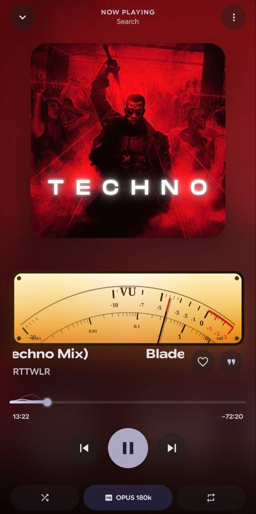
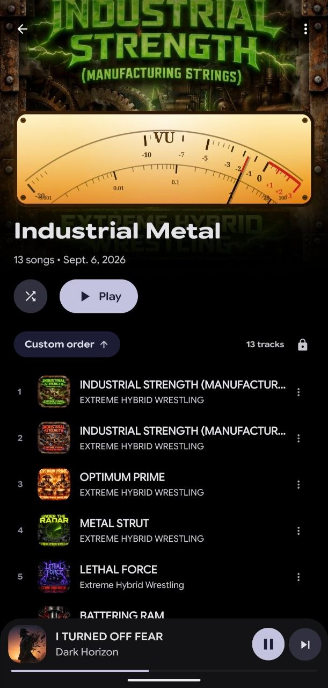

<div align="center">


# LastWave-Jnr v4.2.1

**High-Resolution Lossless Music Streaming & Player with Real-Time Synced Lyrics & Smart Discovery for Android, built with Material 3 Expressive design.**
 **Fork Highlight:** Based on [LastWave-Native](https://github.com/Clash-Projects/LastWave-Native) with added Analog VU meter and fixed offline Play functionality (which is still broken in original app).

> **Upstream:** This project is derived from [Clash-Projects/LastWave-Native](https://github.com/Clash-Projects/LastWave-Native). All credit for the core app goes to the original authors.

<p align="center">
  <a href="#">
    
  </a>
  <a href="https://github.com/Centurion-Rome/LastWave-Jnr/releases">
    
  </a>
  <a href="#">
    
    
  </a>
  <a href="#">
    
  </a>
</p>

</p>

</div>

<br/>

<div align="center">
  
  
  
  <br/>
  <br/>
  
  
  
</div>

<br/>

##  Overview

**LastWave** is a modern native Android music client powered by the global YouTube Music catalog, designed for listeners who want intelligent recommendations, kinetic visuals, and seamless music tracking. 

Built with **Material 3 Expressive**, LastWave combines effortless ad-free streaming, an AI-powered smart playlist generator, real-time synchronized karaoke lyrics, and a built-in Last.fm scrobbler that watches your playback across your favorite music apps.

---

##  Key Features

| Icon | Feature | Highlight |
|:---:|:---|:---|
|  | **YouTube Music Client** | Stream tracks, albums, artists, and public playlists from YouTube Music with zero ads and background playback. |
|  | **Smart Playlist Generator** | Algorithmic taste mixes and mood radios generated from your listening history, seed artists, loved tracks, and top genres. |
|  | **Universal Last.fm Scrobbler** | Built-in media scrobbler tracking listening activity across YouTube Music, Spotify, Apple Music, and local players with zero battery drain. |
|  | **Real-Time Synced Lyrics** | Millisecond-accurate animated karaoke lyrics powered by LRCLIB with 8 customizable fluid physics motions. |
|  | **Offline Downloader** | One-tap downloads saved directly to local storage (`Music/LastWave`), fully tagged with high-res cover art and synchronized `.lrc` lyrics. |
|  | **Discovery Feed & Genre DNA** | Personalized recommendation radar with deep genre breakdowns, weekly listening recaps, and instant "Start Mix" radios. |
|  | **Cross-Platform Playlist Import** | Instantly import public playlists from Spotify and Apple Music directly into your LastWave library. |
|  | **Social Feed & Friends** | Follow friends' listening activity via Last.fm, browse their recent scrobbles, and explore their top tracks. |
|  | **Material 3 Expressive** | Dynamic wallpaper theming, custom HSL color palette engine, album art color extraction, fluid card animations, and tactile haptics. |

---

##  Tech Stack & Architecture

- **Language & UI:** 100% Kotlin + Jetpack Compose (Material 3 Expressive)
- **Audio Engine:** AndroidX Media3 ExoPlayer with lockscreen media controls & Android Auto integration
- **Streaming Catalog:** YouTube Music streaming engine with high-efficiency Opus audio
- **Scrobbling & Tracking:** Last.fm API with native OS media session tracking
- **Lyrics Engine:** [LRCLIB](https://lrclib.net) millisecond-synchronized lyrics
- **Architecture:** MVVM + Clean Architecture, Room DB, Jetpack DataStore, Dagger Hilt, Coroutines & Flow

---

##  Getting Started

1. Download the latest APK from **[Releases](https://github.com/Centurion-Rome/LastWave-Jnr/releases)**.
2. Install the release APK from the Releases page.
3. Connect your Last.fm account to sync your scrobbles, taste profile, and discovery feed.
4. Start streaming in bit-perfect lossless quality.

---

##  Building from Source

```bash
git clone https://github.com/Clash-Projects/LastWave-native.git
cd LastWave-native
./gradlew assembleRelease
```

---

##  Community & Support

*  **Updates & Support:** [Join @clashprojects on Telegram](https://t.me/clashprojects)
*  **More From Us:** [Join @MaterialYouApp on Telegram](https://t.me/MaterialYouApp)
*  **Discord Community:** [Join Discord](https://discord.gg/DmyM2p2fMe)
*  **LastWave Website:** [visit site now](https://lastwave.pages.dev)

---

##  Disclaimer

> [!NOTE]
> **Educational & Research Notice**
>
> LastWave is an open-source, non-commercial application developed strictly for research and educational purposes to demonstrate modern Android application architecture with Jetpack Compose and AndroidX Media3.
>
> **No Affiliation & Content Policy**
> - LastWave is an independent project and is **not affiliated with, endorsed, or sponsored by Google LLC, YouTube, YouTube Music, Spotify, Apple Inc., Last.fm, or any music service**.
> - LastWave **does not host, stream from private servers, or distribute any copyrighted media**. All content and metadata are accessed directly from public endpoints in accordance with their respective terms. All trademarks belong to their respective owners.

---

<div align="center">
  <p><b>LastWave</b> is built with ❤️ by <a href="https://github.com/duxtami">Duxtami</a> & <a href="https://github.com/ajisth69">Ajisth</a>.</p>
</div>

[](https://gitgem.org/github/Clash-Projects/LastWave-Native)
